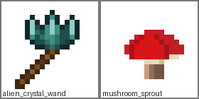

# mc-mod-art-studio

用**纯文本 LLM**（不需要多模态/看图）生成 Minecraft 自定义美术资源：16x16 item、方块多面、十字 cross、实体 UV 等。

工作原理：把贴图序列化成 `W/H + PALETTE + INDEX GRID` 文本，LLM 读文本、按格式输出像素答案，再转 PNG 并打包成资源包。

## 快速开始

```bash
# 1) 安装依赖（只需要 Pillow）
pip install pillow

# 2) 配置 LLM（用你自己的 API key；不配置也能用现成示例跑通）
cp .env.example .env
# 编辑 .env：设置 LLM_API_KEY=sk-xxx（可选 LLM_BASE_URL / LLM_MODEL）
set -a; source .env; set +a

# 3) 一键运行
#    方式 A：直接用示例 raw_answer（不调用 LLM，离线可跑）
python3 run_pipeline.py --query "异形水晶法杖" --form item \
    --raw examples/alien_crystal_wand/raw_answer.txt \
    --out out/alien_crystal_wand

#    方式 B：调用 LLM 生成新资源
python3 run_pipeline.py --query "异形水晶法杖" --form item --top 5 \
    --llm-cmd 'python3 llm_client.py --prompt-file {prompt_file}' \
    --out out/alien_crystal_wand

#    方式 C：顺手打包成 Minecraft 资源包
python3 run_pipeline.py --query "异形水晶法杖" --form item \
    --llm-cmd 'python3 llm_client.py --prompt-file {prompt_file}' \
    --out out/alien_crystal_wand --package

# 4) 查看产物
ls out/alien_crystal_wand/                 # sprite.png / prompt_pack.json / raw_answer.txt
ls out/alien_crystal_wand/resourcepack/    # --package 时生成
```

## LLM 配置

`llm_client.py` 兼容任意 OpenAI `chat/completions` 接口，通过环境变量提供密钥与模型：

```bash
export LLM_API_KEY=sk-xxxx
export LLM_BASE_URL=https://opencode.ai/zen/go/v1
export LLM_MODEL=deepseek-v4-flash
```

（如果你的服务商不是 opencode-go，把 `LLM_BASE_URL` / `LLM_MODEL` 换成它的地址和模型名即可；`.env` 示意见 `.env.example`。）

## 常用参数

| 参数 | 作用 |
|---|---|
| `--query` | 你的想法，例如 “异形水晶法杖”“蘑菇幼苗” |
| `--form` | `item` / `block_multi` / `cross` / `entity_uv` / `auto` |
| `--top` | 检索参考节点数 `1..8`（默认 3） |
| `--mc-path` | 扫描你的 Minecraft/资源包目录，用你本机的素材做参考 |
| `--index` | 用之前 `scan_mc_assets.py` 生成的索引 |
| `--raw` | 用现成 raw_answer.txt，跳过 LLM |
| `--llm-cmd` | 调用外部 LLM 命令，支持 `{prompt}` / `{prompt_file}` |
| `--package` | 同时打包资源包 |
| `--out` | 输出目录 |

## 方块可拼贴：block_multi

`block_multi` 不是“一张透明剪影”，而是三张 **16x16 全不透明方块面**：

| 文件 | 用途 | 模型变量 |
|---|---|---|
| `<name>_top.png` | 方块顶面 | `#top` |
| `<name>_side.png` | 四个侧面共用 | `#side` |
| `<name>_bottom.png` | 方块底面 | `#bottom` |

`package_asset.py` 对 `block_multi` 使用 `minecraft:block/cube_bottom_top` 父模型；
因此三张贴图必须满足：

1. 边缘完全不透明（alpha >= 128，默认 checker 强制）。
2. `side` 左右两列一致，四个侧面绕一圈才能无缝平铺。
3. `side` 顶行与 `top` 四边、`side` 底行与 `bottom` 四边颜色连续（阈值内）。

用 `check_tiling.py` 自动验证：

```bash
python3 check_tiling.py \
  --top tests/runs/v3/glowstone/assets/mcmod/textures/block/q_836777f3_top.png \
  --side tests/runs/v3/glowstone/assets/mcmod/textures/block/q_836777f3_side.png \
  --bottom tests/runs/v3/glowstone/assets/mcmod/textures/block/q_836777f3_bottom.png \
  --name glowstone --out-dir tests/results/v3
```

常用参数：`--threshold <RGB最大通道差>`（默认 32）、`--allow-transparent`（仅比较 RGB，不要求不透明）、`--out-json` / `--out-md` / `--out-dir`。内置自测：`python3 check_tiling.py --self-test`。设计细节见 `docs/tiling-design.md`。

## 实体 UV 标准：entity_uv

Java 原版实体模型是**硬编码**的；资源包只能替换
`assets/minecraft/textures/entity/<path>.png`，不能靠普通模型 JSON 直接换实体模型。
因此“可用的实体 UV”至少要求尺寸与 atlas 区域语义正确。

当前 `check_entity_uv.py` 内置猪 / 苦力怕的标准 64x32 atlas 占位区域：

| 实体 | 尺寸 | head | body | legs |
|---|---|---|---|---|
| pig | 64x32 | `0,0 -> 32,16` | `28,8 -> 64,32` | `0,16 -> 16,26` |
| creeper | 64x32 | `0,0 -> 32,16` | `16,16 -> 40,32` | `0,16 -> 16,26` |

（玩家皮肤另有 64x64 / 64x32 标准布局，见 `docs/entity-uv-design.md` 与 `entity_uv_spec.py`。）

用 `check_entity_uv.py` 验证：

```bash
python3 check_entity_uv.py tests/runs/v3/pig/sprite.png --entity pig \
  --json tests/results/v3/pig_entity_uv.json --md tests/results/v3/pig_entity_uv.md
python3 check_entity_uv.py --self-test
```

检查项包括：尺寸、非空、画布边距（atlas 左右至少 1px；顶/底为说明项）、以及每个标准区域非空。设计细节见 `docs/entity-uv-design.md`。

## 完整资产参考

本仓库**不内置原版素材**，但保留可复现的参考来源与模板：

- **仓库内可复用参考**
  - `builtin_models_fallback/`：blockstate / model 几何占位模板（chest、stairs、door、fence 等）。
  - `docs/`：`method-survey.md`（原版模型/实体 UV/资产来源调研）、`tiling-design.md`、`entity-uv-design.md`、`prompt-design.md`、`check_pixel_asset.md`。
  - `examples/` 与 `tests/test_set.md`：项目自证示例与非自证测试集，后者不把前者当“正确答案”。
  - `evidence/`：`review-1.md`（v2 复核）、`review-2.md`（v3 复核）、`review-template.md`（可复用清单）、`entity-uv-*` 与 `tiling-baseline*` 证据。
- **原版素材来源（外部，不入库）**
  - Minecraft Wiki：方块模型 Tutorial:Models、实体资源包、Skin 坐标。
  - 公开 vanilla assets 镜像（如 `InventivetalentDev/minecraft-assets`）可补原版模型/blockstate/实体 UV 参考。
  - `vanilla_entity_ref/` 仅本地保留纸质 UV 模板，已被 `.gitignore` 排除；克隆仓库不会得到原版 PNG。
- **坐标系说明**
  - 方块贴图：16x16，`cube_bottom_top` 的变量为 `#top/#bottom/#side`；`uv` 使用 0–16 的百分比坐标。
  - 实体贴图：坐标原点为左上，`x1,y1 -> x2,y2` 表示半开区间 `[x1,x2) × [y1,y2)`；Java 实体直接按原版 atlas 布局采样。

## 设计流程

`run_pipeline.py` 自动完成：

```
扫描/索引 → 检索参考节点(1..8) → 语义概念卡 → 提示包 → LLM 输出像素文本 → PNG → 资源包
```

生成时模型会先被要求“理解这个物体是什么”，再设计：

- 配色方案（主色/亮部/暗部/描边色/饱和度）
- 形状图样（每个部件的形状 → 纹样沿形状结构走向）
- 参考节点（多个，作为设计参考，不是硬性指标）

## 像素细节规则

提示词中加入了**不绑定具体物品的通用像素细节规则**，统一维护在
`concept_grounder.GENERIC_PIXEL_DETAIL_RULES`，并在 `run_pipeline` 的最终 prompt 中逐条写入：

1. **1px 边框/描边**：外轮廓用 `1px 深色描边`；部件接缝用暗色分隔；不做均匀黑框。
2. **材质高光**：亮部高光沿形状走向，暗部在背光侧；金属/木/石/发光/软质等不同材质按语义推理使用不同高光强度与纹理提示。
3. **纹理**：材质纹理（木纹/石裂纹/金属划痕/发光颗粒等）贴合形状；有原版参考则参考其质感，没有则按语义推理合理材质。
4. **明暗分层**：每个部件至少 `base/light/dark` 三档色阶；用 `1px` 明暗过渡表现体积，避免平涂。
5. **方向/连接**：整体方向一致，部件连接自然、不悬空。

详细设计与验证说明见 `docs/prompt-design.md`。这些规则与 `check_pixel_asset.py` 的
非空/bbox/深色描边/明暗分桶检查对齐：先约束生成，再用像素检查器出具可复现证据。

## 测试与证据

### 非自证广谱测试集

- `tests/` 是**非自证广谱测试集**：不使用 `examples/`、`concept_examples/` 或用户点名示例作为“正确答案”。
- `tests/test_set.md` 定义 t01–t12 测试条目（钻石剑、金苹果、弓、荧石、红砖、青金石块、虞美人、橡树树苗、猪、苦力怕、箱子、石砖楼梯）。
- `tests/README.md` 记录运行协议、`block_custom` 缺口与通过标准。
- v2 结果：`tests/results/v2/summary.md` / `summary.json` / `tests/evidence/v2/*.md`；
  t01–t10 全部 `PIPELINE PASS`，所有 16 张 checker 报告均非空。
- v3 结果：`tests/results/v3/summary.md` / `summary.json` / `tests/results/v3/*_tiling.json|.md` / `*_entity_uv.json|.md` / `bow_pixel.json`；
  覆盖 block_multi 非空方块面、实体 UV 标准区域、bow 负空间。
- 可复用审核：`evidence/review-template.md` 是独立复核清单；`evidence/review-1.md` 是 v2 广谱测试的可复用审核记录，`evidence/review-2.md` 是 v3 可拼贴/实体 UV/bow 的独立复核记录。

`tests/runs/` 是本地生成的大产物（PNG/raw/resourcepack），**不入库**（见 `.gitignore`）；
`tests/reports/`（每张 PNG 的 JSON 像素证据）、`tests/evidence/` 与 `tests/results/summary*`
入库保留。克隆后如需复跑 runs，按 `tests/README.md` 的命令重新生成。

### check_pixel_asset.py

`check_pixel_asset.py` 是通用像素级检查器，提供非空、bbox、深色描边、亮度色阶、部件分离启发式等指标：

```bash
# 查看终端摘要
python3 check_pixel_asset.py examples/alien_crystal_wand/sprite.png

# 输出 JSON 证据
python3 check_pixel_asset.py examples/alien_crystal_wand/sprite.png \
    --out examples/check-evidence/alien_crystal_wand.json

# 输出 Markdown 证据
python3 check_pixel_asset.py examples/mushroom_sprout/cross.png \
    --out examples/check-evidence/mushroom_sprout_cross.md

# 合成图自测
python3 check_pixel_asset.py --self-test
```

常用可调参数：`--expected-size`（如 `64x32`）、`--opaque-min`、`--min-margin`、
`--border-dark-lum`、`--dark-lum`、`--bright-lum`、`--require-separation`。
完整说明见 `docs/check_pixel_asset.md`。

### 非空门禁与 parser 容错

- **非空门禁**：`run_pipeline.py` 在生成 PNG 后调用 `_assert_nonempty_pngs()`；任何一张图
  不透明像素为 0 都会输出 `PIPELINE: FAIL` 并附具体文件，**不会再错误地报 PASS**。
- **parser 容错**：`text_to_texture.py` 支持 `PALETTE` 行行尾 `#` 注释；INDEX/HEX GRID
  多出透明尾列可裁剪、少写尾部透明列自动补 `-1` / `----`；entity_uv 多出的尾行（包括
  非全 `-1` 但不影响已有行语义的行）会按容错规则处理，不再因整段多余数据整体 FAIL。

这两项改进在 v2 广谱测试中体现为：t01–t10 全部非空、pipeline 全部 PASS；详见
`tests/results/v2/summary.md`。

## 示例



- `examples/alien_crystal_wand/`：顶部水晶簇法杖（低饱和青绿 + 深色描边 + 纵向棱面高光）。
- `examples/mushroom_sprout/`：cross 形式的小蘑菇（内容=蘑菇本体，不是树苗）。

## 自检

```bash
python3 scan_mc_assets.py --self-test
python3 retrieve_assets.py --self-test
python3 concept_grounder.py --self-test
python3 build_style_prompt.py --self-test
python3 compose_asset.py --self-test
python3 package_asset.py --self-test
python3 check_pixel_asset.py --self-test
python3 check_tiling.py --self-test
python3 check_entity_uv.py --self-test
python3 -m unittest discover -s tests -v
```
