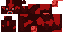
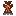

# mc-mod-art-studio

`mc-mod-art-studio` 是一个把“想法”变成 Minecraft 自定义美术资源的最小流水线。它面向**非多模态的纯文本 LLM**：不需要模型直接看图，而是把参考素材转成文本特征，让模型按照 `W/H + PALETTE + INDEX GRID` 生成像素，再转成 PNG 并打包为 Minecraft 资源包。

## 工作流概念：借鉴但不照抄

核心思路是**从原版资产中学习“语法”，而不是背诵“答案”**。每次生成把输入分成三层：

1. **意图层**：你的想法/概念卡，决定“做什么”（语义、部件、氛围、用途）。
2. **参考层**：原版资产的文本化特征，提供“材质语法”而不是具体像素答案：
   - 配色家族（主色/亮部/暗部/描边关系）
   - 材质纹理节奏（木纹、金属、石缝、发光、生物皮肤）
   - 结构比例（弓臂粗细、剑刃/柄比例、方块面/实体 UV 布局）
   - 实体 UV 区域语义
3. **约束层**：通用像素规则 + 形式硬约束 + `--novelty` 参数。

`reference_analyzer.py` 把原版 compact 文本提炼成结构化参考语法（`palette_family`、`material_signature`、`structure_hints`、`uv_regions`），并在 prompt 中固定标注：

> 借鉴但不照抄：形状/纹理/配色可按需要修改。

`--novelty` 控制“贴近原版”与“大胆创新”的平衡：

| novelty | 行为 |
|---|---|
| `0` | 最贴近原版质感，适合做资源包替换 |
| `0.5`（默认） | 学到语法后自由组合 |
| `1` | 更大胆的新设计/风格转换 |

`--no-original-ref` 可以完全关闭原版参考块，回到“仅语义摘要”模式。

## 轮廓基础（silhouette bank）

在“部件级参考”之上，s2 增加了一个形状语法层：`reference_analyzer.build_silhouette_bank()` 为每个部件抽取 **2–4 个轮廓候选**（`shape token` 或 `X/.` 剪影片段），并且 prompt 中固定写明：

> 形状候选 = 菜单，不是锁。
> - 可选其中一个；
> - 可组合多个；
> - 可大改形状（加长/加粗/弯曲/变形/换比例都允许）；
> - 禁止把候选当成最终网格/逐像素复制候选剪影。

这样解决“形状借鉴过缩/过抄”：既不给一句模糊描述让模型乱画，也不把整件原版 compact 当作答案。`form=entity_uv` 时按原版 atlas 区域（`head/horns/ears/muzzle/body/legs/tail` 等）切候选，而不是把实体压成 16x16 居中图标。视觉 LLM 可通过 `--llm-image` / `llm_client --image` 多次传入多张原版 PNG 参考。

更多设计说明见 `docs/silhouette-bank.md`。

## 快速开始

```bash
# 1) 安装依赖（只需要 Pillow）
pip install pillow

# 2) 配置 LLM（用自己的 API Key；不配置也能用现成 raw_answer 离线跑通）
cp .env.example .env
# 编辑 .env：LLM_API_KEY=sk-xxx（可选 LLM_BASE_URL / LLM_MODEL）
set -a; source .env; set +a

# 3) 离线复现示例：使用已有 raw_answer，不调用 LLM
python3 run_pipeline.py --query "异形水晶法杖" --form item \
    --raw examples/alien_crystal_wand/raw_answer.txt \
    --out out/alien_crystal_wand

# 4) 在线生成新资源
python3 run_pipeline.py --query "异形水晶法杖" --form item --top 5 \
    --llm-cmd 'python3 llm_client.py --prompt-file {prompt_file}' \
    --out out/alien_crystal_wand

# 5) 使用本机原版/资源包作为参考
python3 scan_mc_assets.py --mc-path ~/.minecraft --out my_asset_index.json --with-palette
python3 run_pipeline.py --query "弓" --form item --top 5 \
    --index my_asset_index.json \
    --novelty 0.5 \
    --llm-cmd 'python3 llm_client.py --prompt-file {prompt_file}' \
    --out out/bow --package
```

常用参数：

| 参数 | 作用 |
|---|---|
| `--query` | 你的想法，例如 “异形水晶法杖”“弓” |
| `--form` | `item` / `block_multi` / `cross` / `entity_uv` / `auto` |
| `--top` | 检索参考节点数 `1..8`（默认 3） |
| `--index` | 使用 `scan_mc_assets.py` 生成的索引 |
| `--novelty` | `0..1`，默认 `0.5`；越高越自由，越低越贴原版 |
| `--no-original-ref` | 关闭原版参考块，只用语义生成 |
| `--raw` | 使用现成 `raw_answer.txt`，跳过 LLM |
| `--llm-cmd` | 调用外部 LLM 命令，支持 `{prompt}` / `{prompt_file}` |
| `--package` | 同时打包为 Minecraft 资源包 |
| `--out` | 输出目录 |

`llm_client.py` 兼容任意 OpenAI `chat/completions` 文本接口，通过环境变量配置：

```bash
export LLM_API_KEY=sk-xxx
export LLM_BASE_URL=https://opencode.ai/zen/go/v1
export LLM_MODEL=deepseek-v4-flash
```

完整流程由 `run_pipeline.py` 串起：

```text
扫描/索引 → 检索参考节点 → 语义概念卡 → 提示包 → LLM/raw_answer → PNG → 资源包
```

## 效果图（rebuild-demo）

以下 4 张 PNG 来自 `examples/rebuild-demo/`，是当前主打演示，均带 **silhouette bank（轮廓候选/可大改）**。其中 `demon_cow` 使用 `entity_uv` 64x32（cow/red_mooshroom 实体模板），不再是 16x16 牛头图标。

| 资产 | form | 图片 | 轮廓基础摘要 |
|---|---|---|---|
| 恶魔牛 (Demon Cow) | `entity_uv` 64x32 |  | cow / red_mooshroom / brown_mooshroom / soul_fire 区域轮廓 |
| 骷髅法杖 (Skeleton Staff) | `item` |  | skeleton head / bone_block / stick / iron_sword |
| 剥皮小刀 (Skinning Knife) | `item` |  | iron/stone/wooden_sword / shears / leather / stick |
| 村民皮 (Villager Hide) | `item` |  | leather / rabbit_hide / villager 毛边皮张 |

每个资产目录下的 `README.md` 记录部件 → 原版参考 → 轮廓基础 → 改了什么，以及 `prompt_pack.json` 中的 `silhouette_candidates`。汇总与复现命令见 `examples/rebuild-demo/README.md`。

## 历史：novel-demo（第一版部件级参考）

以下为早期 `examples/novel-demo/` 的展示，已被 `rebuild-demo` 取代/继承，保留作为历史参考。它以“部件级参考映射”为核心，但没有 silhouette bank；其中 `demon_cow` 原为 16x16 `item` 牛头图标（已在 rebuild-demo 修正为 `entity_uv` 64x32）。

`novel-demo` 的生成采用“部件级参考映射”：不找一件最像的原版整件照抄，而是把新资产拆成**部件**，每个部件只从指定原版资产借用三样信息：

| 借用维度 | 含义 | 示例 |
|---|---|---|
| `borrowed_texture` | 只借材质/纹样语法 | 皮革颗粒、金属划痕、骨裂纹、木纹 |
| `borrowed_palette` | 每个部件拥有独立配色卡（base/light/dark/accent/outline） | 骨白、皮革棕、钢铁灰、魂火青 |
| `borrowed_structure` | 只借结构/比例/布局 | 头部位置、刃口走向、握柄宽度、明暗体积 |

配色严格按部件拆分，**不做全图统一调色板**，避免不同材质被同一个全局色表抹掉差异。每个部件的参考来源都记录 `borrowed_texture` / `borrowed_palette` / `borrowed_structure` 三列，并明确“不借什么”（不复制整件原版物品的形态/索引网格）。

| 资产 | 部件级参考摘要 |
|---|---|
| 村民皮 (Villager Hide) | 皮面主体 ← `leather.png`（皮革颗粒/折痕）；织物内衬 ← `villager.png`（村民长袍层叠/缝线）；挂环/标签 ← `stick.png` + `iron_sword.png`（木/金属小件结构） |
| 剥皮小刀 (Skinning Knife) | 刀刃 ← `iron_sword.png`（金属划痕/刃口高光）；护手/颈 ← `iron_sword.png` + `leather.png`；刀柄 ← `leather.png` + `stick.png`/`oak_planks.png`（皮革缠绳/木芯） |
| 骷髅法杖 (Skeleton Staff) | 骷髅头/眼窝 ← `skeleton.png`（head region）+ `bone_block_side.png`（骨白/骨裂纹）；连接插座 ← `bone_block_side.png` + `stick.png`；杖身/握柄 ← `stick.png` + `oak_planks.png`（木纹/磨损） |
| 恶魔牛 (Demon Cow) | 牛头 ← `cow.png` + `red_mooshroom.png`（红黑皮肤/鼻梁高光）；双角/耳朵 ← `cow.png` + `red_mooshroom.png`；眼睛/鼻口 ← `red_mooshroom.png` + `soul_fire_0.png`（青色魂火/黑色眼窝） |

完整的逐部件来源表、原版参考 hash、`不借什么`、局部配色卡与复现命令见 `examples/novel-demo/README.md` 及各资产目录下的 `README.md`（历史版）。当前主演示请以 `examples/rebuild-demo/README.md` 为准。

## 核心模块

| 模块 | 作用 |
|---|---|
| `run_pipeline.py` | 一键整合：scan → retrieve → concept → prompt → LLM/raw → PNG → package |
| `scan_mc_assets.py` | 扫描 Minecraft/资源包/模组目录，生成本地资产索引 |
| `retrieve_assets.py` | 按想法检索 1–8 个参考节点并提取结构化特征 |
| `concept_grounder.py` | 生成语义概念卡（物品是什么、部件、配色、形状、参考） |
| `reference_analyzer.py` | 把原版 compact 文本提炼为参考语法，生成 `silhouette bank` 轮廓候选（形状 token / X/. 剪影）与不逐像素复制的参考块 |
| `build_style_prompt.py` | 组装提示包：参考语法 + silhouette bank + 通用像素规则 + 形式硬约束 + novelty |
| `text_to_texture.py` | 把 LLM 的 `PALETTE + INDEX GRID` 文本解析为 PNG |
| `asset_to_text.py` | 把任意 PNG 转成逐像素文本（复用 `texture_to_text`） |
| `minecraft_texture_tool/texture_to_text.py` | 底层确定性 PNG → 文本转换 |
| `package_asset.py` | 打包 item/block_multi/cross/entity_uv 为 Minecraft 资源包 |
| `check_pixel_asset.py` | 通用像素检查：非空、bbox、深色描边、色阶、部件分离 |
| `check_tiling.py` | 检查 block_multi 三面能否无缝拼成方块 |
| `check_entity_uv.py` | 检查实体 UV 尺寸/边距/标准区域 |
| `compose_asset.py` | 多面/形状组合与预览合成（可选） |
| `fix_tiling.py` | 通用方块边缘 seam-stitch 后处理 |
| `fix_entity_margin.py` | 通用实体 atlas 画布边距后处理 |
| `entity_uv_spec.py` | 原版实体 UV 契约与标准区域 |
| `llm_client.py` | OpenAI-compatible 文本 LLM 调用 |

## 自检

所有自检均使用合成资源，不依赖原版素材：

```bash
python3 scan_mc_assets.py --self-test
python3 retrieve_assets.py --self-test
python3 concept_grounder.py --self-test
python3 build_style_prompt.py --self-test
python3 text_to_texture.py --self-test
python3 asset_to_text.py --self-test
python3 package_asset.py --self-test
python3 compose_asset.py --self-test
python3 check_pixel_asset.py --self-test
python3 check_tiling.py --self-test
python3 check_entity_uv.py --self-test
python3 fix_tiling.py --self-test
python3 fix_entity_margin.py --self-test
python3 reference_analyzer.py
python3 -m unittest discover -s tests -v
```

## 仓库结构

```text
.
├── README.md                  # 本文件
├── design-doc.md              # 核心设计文档
├── run_pipeline.py            # 一键流水线
├── scan_mc_assets.py
├── retrieve_assets.py
├── concept_grounder.py
├── reference_analyzer.py
├── build_style_prompt.py
├── text_to_texture.py
├── asset_to_text.py
├── package_asset.py
├── check_pixel_asset.py
├── check_tiling.py
├── check_entity_uv.py
├── compose_asset.py
├── fix_tiling.py
├── fix_entity_margin.py
├── entity_uv_spec.py
├── llm_client.py
├── builtin_models_fallback/   # 内置 blockstate/model 模板
├── examples/                  # 最小示例 + 新资产效果图
│   ├── alien_crystal_wand/    # item 离线示例
│   ├── mushroom_sprout/       # cross 示例
│   ├── novel-demo/            # 历史：第一版部件级参考（村民皮/剥皮小刀/恶魔牛/骷髅法杖）
│   │   ├── villager_hide/     # sprite.png + README.md + prompt/raw/hash
│   │   ├── skinning_knife/
│   │   ├── demon_cow/
│   │   ├── skeleton_staff/
│   │   ├── README.md          # 资产清单 + 来源表 + 复现命令（历史版）
│   │   └── demo_generate.py
│   ├── rebuild-demo/          # 当前主演示：s2 silhouette bank + 4 个重做演示
│   │   ├── demon_cow/         # entity_uv 64x32（cow/red_mooshroom 模板改）
│   │   ├── skeleton_staff/
│   │   ├── skinning_knife/
│   │   ├── villager_hide/
│   │   ├── README.md          # 资产清单 + 轮廓基础 + 复现命令
│   │   ├── rebuild_generate.py
│   │   └── build_programmatic_demos.py
│   └── reset-demo/            # 旧版演示图（bow/bricks/creeper/pig，保留供 docs 示例/历史参考）
├── docs/
│   ├── workflow-concept.md
│   ├── prompt-design.md
│   ├── silhouette-bank.md    # 轮廓基础/多图参考/cow 实体模板说明
│   ├── shape-problem-analysis.md
│   └── check_pixel_asset.md
├── tests/                     # 核心脚本单元测试
├── requirements.txt
├── .env.example
└── .gitignore
```

本仓库**不包含原版 Minecraft PNG/素材**；原版参考仅通过本地扫描索引或外部公开来源获取，克隆后不会得到原版贴图。
