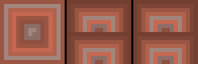

# mc-mod-art-studio

`mc-mod-art-studio` 是一个把“想法”变成 Minecraft 自定义美术资源的最小流水线。它面向**非多模态的纯文本 LLM**：不需要模型直接看图，而是把参考素材转成文本特征，让模型按照 `W/H + PALETTE + INDEX GRID` 生成像素，再转成 PNG 并打包为 Minecraft 资源包。

## 工作流概念：借鉴但不照抄

核心思路是**从原版资产中学习“语法”，而不是背诵“答案”**。每次生成把输入分成三层：

1. **意图层**：你的想法/概念卡，决定“做什么”（语义、部件、氛围、用途）。
2. **参考层**：原版资产的文本化特征，提供“材质语法”而不是具体像素答案：
   - 配色家族（主色/亮部/暗部/描边关系）
   - 材质纹理节奏（木纹、金属、石缝、发光、生物皮肤）
   - 结构比例（弓臂粗细、剑刃/柄比例、方块面/实体 UV 布局）
   - 实体 UV 区域语义
3. **约束层**：通用像素规则 + 形式硬约束 + `--novelty` 参数。

`reference_analyzer.py` 把原版 compact 文本提炼成结构化参考语法（`palette_family`、`material_signature`、`structure_hints`、`uv_regions`），并在 prompt 中固定标注：

> 借鉴但不照抄：形状/纹理/配色可按需要修改。

`--novelty` 控制“贴近原版”与“大胆创新”的平衡：

| novelty | 行为 |
|---|---|
| `0` | 最贴近原版质感，适合做资源包替换 |
| `0.5`（默认） | 学到语法后自由组合 |
| `1` | 更大胆的新设计/风格转换 |

`--no-original-ref` 可以完全关闭原版参考块，回到“仅语义摘要”模式。

## 快速开始

```bash
# 1) 安装依赖（只需要 Pillow）
pip install pillow

# 2) 配置 LLM（用自己的 API Key；不配置也能用现成 raw_answer 离线跑通）
cp .env.example .env
# 编辑 .env：LLM_API_KEY=sk-xxx（可选 LLM_BASE_URL / LLM_MODEL）
set -a; source .env; set +a

# 3) 离线复现示例：使用已有 raw_answer，不调用 LLM
python3 run_pipeline.py --query "异形水晶法杖" --form item \
    --raw examples/alien_crystal_wand/raw_answer.txt \
    --out out/alien_crystal_wand

# 4) 在线生成新资源
python3 run_pipeline.py --query "异形水晶法杖" --form item --top 5 \
    --llm-cmd 'python3 llm_client.py --prompt-file {prompt_file}' \
    --out out/alien_crystal_wand

# 5) 使用本机原版/资源包作为参考
python3 scan_mc_assets.py --mc-path ~/.minecraft --out my_asset_index.json --with-palette
python3 run_pipeline.py --query "弓" --form item --top 5 \
    --index my_asset_index.json \
    --novelty 0.5 \
    --llm-cmd 'python3 llm_client.py --prompt-file {prompt_file}' \
    --out out/bow --package
```

常用参数：

| 参数 | 作用 |
|---|---|
| `--query` | 你的想法，例如 “异形水晶法杖”“弓” |
| `--form` | `item` / `block_multi` / `cross` / `entity_uv` / `auto` |
| `--top` | 检索参考节点数 `1..8`（默认 3） |
| `--index` | 使用 `scan_mc_assets.py` 生成的索引 |
| `--novelty` | `0..1`，默认 `0.5`；越高越自由，越低越贴原版 |
| `--no-original-ref` | 关闭原版参考块，只用语义生成 |
| `--raw` | 使用现成 `raw_answer.txt`，跳过 LLM |
| `--llm-cmd` | 调用外部 LLM 命令，支持 `{prompt}` / `{prompt_file}` |
| `--package` | 同时打包为 Minecraft 资源包 |
| `--out` | 输出目录 |

`llm_client.py` 兼容任意 OpenAI `chat/completions` 文本接口，通过环境变量配置：

```bash
export LLM_API_KEY=sk-xxx
export LLM_BASE_URL=https://opencode.ai/zen/go/v1
export LLM_MODEL=deepseek-v4-flash
```

完整流程由 `run_pipeline.py` 串起：

```text
扫描/索引 → 检索参考节点 → 语义概念卡 → 提示包 → LLM/raw_answer → PNG → 资源包
```

## 效果图

以下 4 张 PNG 来自 `examples/reset-demo/`，均由 `run_pipeline.py --novelty 0.5` 生成，未复制任何原版素材。

| 资产 | form | 图片 |
|---|---|---|
| 弓 | `item` |  |
| 红砖 | `block_multi` |  |
| 苦力怕 | `entity_uv` |  |
| 猪 | `entity_uv` |  |

## 核心模块

| 模块 | 作用 |
|---|---|
| `run_pipeline.py` | 一键整合：scan → retrieve → concept → prompt → LLM/raw → PNG → package |
| `scan_mc_assets.py` | 扫描 Minecraft/资源包/模组目录，生成本地资产索引 |
| `retrieve_assets.py` | 按想法检索 1–8 个参考节点并提取结构化特征 |
| `concept_grounder.py` | 生成语义概念卡（物品是什么、部件、配色、形状、参考） |
| `reference_analyzer.py` | 把原版 compact 文本提炼为参考语法，生成不逐像素复制的参考块 |
| `build_style_prompt.py` | 组装提示包：参考语法 + 通用像素规则 + 形式硬约束 + novelty |
| `text_to_texture.py` | 把 LLM 的 `PALETTE + INDEX GRID` 文本解析为 PNG |
| `asset_to_text.py` | 把任意 PNG 转成逐像素文本（复用 `texture_to_text`） |
| `minecraft_texture_tool/texture_to_text.py` | 底层确定性 PNG → 文本转换 |
| `package_asset.py` | 打包 item/block_multi/cross/entity_uv 为 Minecraft 资源包 |
| `check_pixel_asset.py` | 通用像素检查：非空、bbox、深色描边、色阶、部件分离 |
| `check_tiling.py` | 检查 block_multi 三面能否无缝拼成方块 |
| `check_entity_uv.py` | 检查实体 UV 尺寸/边距/标准区域 |
| `compose_asset.py` | 多面/形状组合与预览合成（可选） |
| `fix_tiling.py` | 通用方块边缘 seam-stitch 后处理 |
| `fix_entity_margin.py` | 通用实体 atlas 画布边距后处理 |
| `entity_uv_spec.py` | 原版实体 UV 契约与标准区域 |
| `llm_client.py` | OpenAI-compatible 文本 LLM 调用 |

## 自检

所有自检均使用合成资源，不依赖原版素材：

```bash
python3 scan_mc_assets.py --self-test
python3 retrieve_assets.py --self-test
python3 concept_grounder.py --self-test
python3 build_style_prompt.py --self-test
python3 text_to_texture.py --self-test
python3 asset_to_text.py --self-test
python3 package_asset.py --self-test
python3 compose_asset.py --self-test
python3 check_pixel_asset.py --self-test
python3 check_tiling.py --self-test
python3 check_entity_uv.py --self-test
python3 fix_tiling.py --self-test
python3 fix_entity_margin.py --self-test
python3 reference_analyzer.py
python3 -m unittest discover -s tests -v
```

## 仓库结构

```text
.
├── README.md                  # 本文件
├── design-doc.md              # 核心设计文档
├── run_pipeline.py            # 一键流水线
├── scan_mc_assets.py
├── retrieve_assets.py
├── concept_grounder.py
├── reference_analyzer.py
├── build_style_prompt.py
├── text_to_texture.py
├── asset_to_text.py
├── package_asset.py
├── check_pixel_asset.py
├── check_tiling.py
├── check_entity_uv.py
├── compose_asset.py
├── fix_tiling.py
├── fix_entity_margin.py
├── entity_uv_spec.py
├── llm_client.py
├── builtin_models_fallback/   # 内置 blockstate/model 模板
├── examples/                  # 最小示例 + reset-demo 效果图
│   ├── alien_crystal_wand/    # item 离线示例
│   ├── mushroom_sprout/       # cross 示例
│   └── reset-demo/            # bow.png / bricks.png / creeper.png / pig.png
├── docs/
│   ├── workflow-concept.md
│   ├── prompt-design.md
│   └── check_pixel_asset.md
├── tests/                     # 核心脚本单元测试
├── requirements.txt
├── .env.example
└── .gitignore
```

本仓库**不包含原版 Minecraft PNG/素材**；原版参考仅通过本地扫描索引或外部公开来源获取，克隆后不会得到原版贴图。
